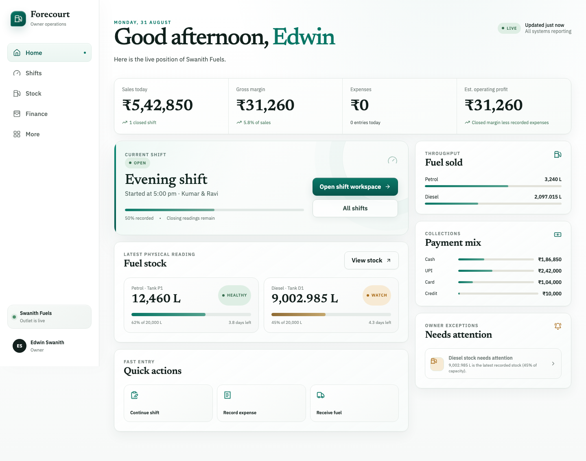
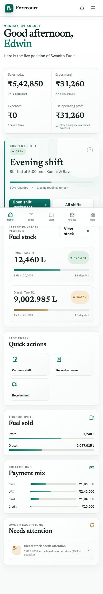
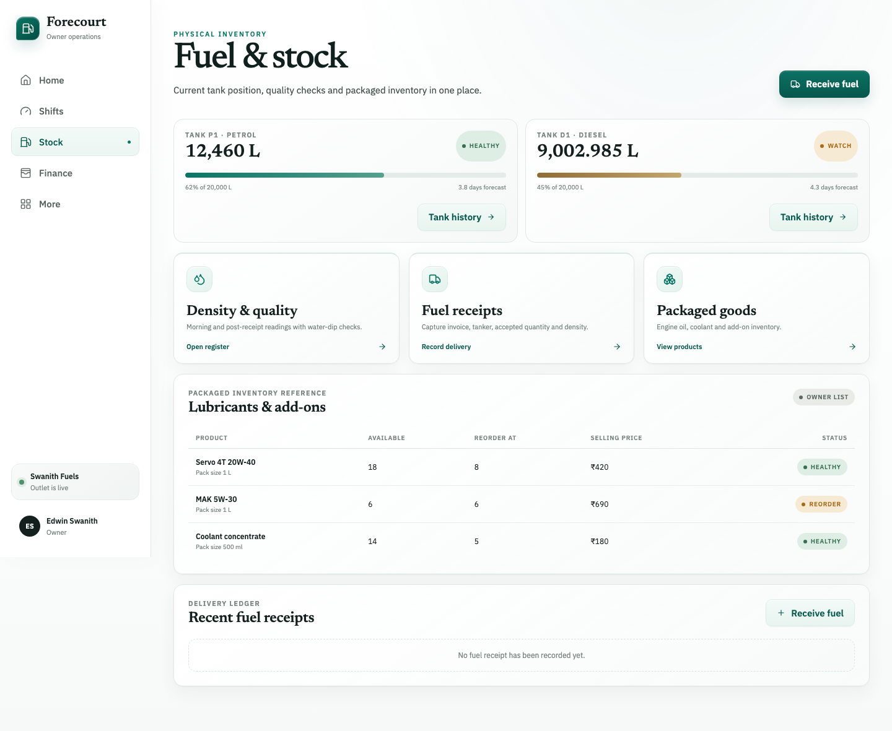

# Forecourt

Forecourt is a responsive, single-owner petrol pump operations system. It connects attendance, staff-to-machine allocation, shift totalizers, fuel receipts, tank reconciliation, collections, expenses, quality checks, staff performance, and daily reporting in one calm operating workspace.

## Product preview



<p align="center">
  
</p>



## What works

- Open one active shift with protected nozzle totalizers and physical tank stock.
- Maintain a staff directory and daily present, late, absent, or leave register with check-in and check-out times.
- Assign one operator to each petrol or diesel machine when the shift opens; assigned operators are marked present automatically.
- Record fuel deliveries, accepted quantities, density evidence, water dips, and expenses.
- Capture returned or non-returned test fuel during shift close.
- Reconcile nozzle sales, physical tank stock, tender totals, cash handover, fuel cost, gross margin, and estimated operating profit with decimal-safe server calculations.
- Include linked fuel receipts and cash/non-cash expenses automatically in the active shift reconciliation.
- Preview every reconciliation before an idempotent, immutable close.
- Calculate litres sold, expected sales value, declared handover, and handover variance for every assigned operator.
- Review live owner dashboards for sales, margin, expenses, fuel stock, throughput, payment mix, and exceptions.
- Export a spreadsheet-safe daily CSV containing summaries, shifts, variances, expenses, and fuel receipts.
- Operate across desktop and mobile layouts without staff accounts, role management, or approval queues.

## Quick start

Requirements: Node.js 20.9 or newer.

```bash
git clone https://github.com/Edwinswanith/Petrol_bunk.git
cd Petrol_bunk
npm ci
npm run dev
```

Open [http://127.0.0.1:3000](http://127.0.0.1:3000).

When `MONGODB_URI` is empty, Forecourt starts in a seeded in-memory review mode. Saved records survive navigation but reset when the server restarts.

## Persistent storage

Copy the environment template:

```bash
cp .env.example .env.local
```

Configure at least:

```dotenv
MONGODB_URI=mongodb+srv://...
MONGODB_DB=forecourt
OWNER_NAME=Edwin
OUTLET_NAME=Swanith Fuels
```

Use a MongoDB deployment that supports transactions so shift opening and closing remain atomic.

## Owner workflow

1. Add staff and record attendance from **Staff & attendance**.
2. Open the shift, allocate one operator to each machine, and record nozzle totalizers and tank stock.
3. Record deliveries, density/water checks, and expenses during the shift.
4. Enter closing totalizers, physical stock, test fuel, tender totals, operator handovers, and declared cash.
5. Review the server-calculated fuel, tank, tender, cash, operator, and margin position.
6. Close and lock the shift. The assigned attendance records receive their check-out time automatically.
7. Review operator litres and handover accuracy, or download the daily operations CSV from Reports.

## Technology

- Next.js 16 and React 19
- TypeScript
- MongoDB with an in-memory review adapter
- Decimal.js for fuel and monetary calculations
- Zod request validation
- Vitest and Testing Library
- Playwright desktop/mobile browser journeys

## Verification

```bash
npm test
npm run test:coverage
npm run test:e2e
npm run typecheck
npm run lint
npm run build
```

Current verification baseline:

- 29 unit, component, and integration tests
- 10 desktop/mobile end-to-end journeys
- 98.95% line coverage across the critical calculation and workflow layer
- Production build, TypeScript, ESLint, dependency audit, and secret scan passing

The runtime health endpoint is `GET /api/health`.

## v1 boundaries

- One owner, one outlet, one active shift, one petrol nozzle/tank, and one diesel nozzle/tank.
- One operator is assigned to one machine for the full shift in v1. Mid-shift reassignment and shared-nozzle splits are deferred.
- There are no staff accounts, roles, approvals, invitations, or staff-facing screens; the owner records all activity.
- Closed shifts are immutable in v1.
- Packaged-goods stock is an owner reference list rather than a transactional inventory ledger.
- Local review mode has no authentication. Add the owner session/recovery gate and deployment secrets before public exposure.
- Outlet prices, cost basis, tank calibration, density tolerances, OMC procedures, and the hosting target require production confirmation.

See [`IMPLEMENTATION_PLAN.md`](IMPLEMENTATION_PLAN.md) for the complete product, UX, engineering, pilot, and production-readiness roadmap.
